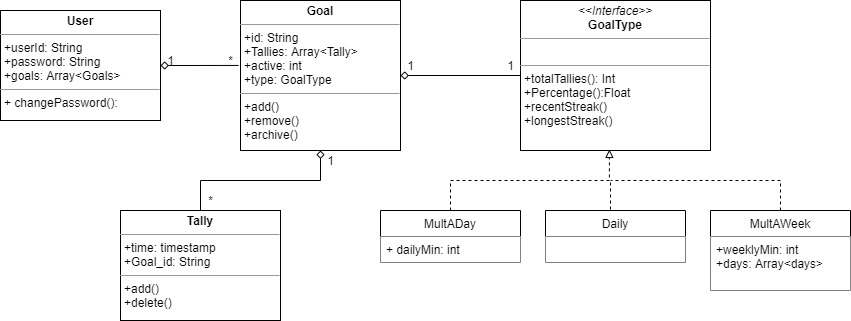

# Tallies: The Goal Tracker
Software Design Project Proposal
Cecily Devaney

## Project Description/Abstract
Tallies is a simplified goal tracker, that lets you keep track of anything you want with a simple tally system. The user can track as many goals as they want by assigning them a name and setting parameters of the goal, such as daily, 5 days a week, only weekends, etc.. The user can also use various features to review their goal tracking data, such as total tallies within a certian time frame, percentage of success, and streaks. Data may be visualized using graphs to make it easy for the user to view and understand. The user will also be able to remove goals or tallies, or archive old goals.

#### UML Class Diagram

## Project Relevance
This project is linked to several educational goals in this class. Firstly, the backend/main structure is object-oriented programming based - or at least inspired, the OOP based UML can be used to plan the app. It will also need a database and a frontend, as well as the api/communication aspect between all the components. The project will also be built with testing along the way (unit or other variations), and will require debugging and optimization throughout the building process.  The project will also be worked on as a team, so to coordinate and combine work will be using version control (via Github), issue tracking, and project management.

## Contribution/Conceptual Design
I have honestly mostly worked on small projects, or when working on larger projects have made small changes/contributions to an already built work, so I have limited experience in a bigger project such as this. I have worked a little with Angular before (which I am suggesting for this project), but on an already established project> I can still contribute the little I know and also learn along the way! I also have limited experience with databases.

## Background
https://github.com/cecilydev/TalliesProposal
(need to add)

## Required Resources
(need to add)
